# Using Font Editor

### Welcome to Font Editor. This is the official app to create and edit bitmap font files in SerenityOS.

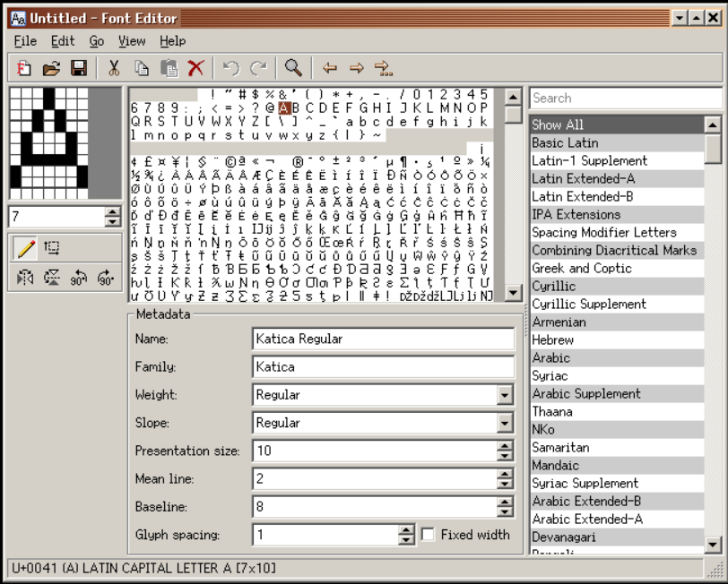

### Basic Parts
FontEditor has the following basic parts:
1. The menu bar at the top
2. The toolbar
3. The main workspace
4. The status bar at the bottom

You can resize the entire FontEditor to your liking. You can turn-on or turn-off Font Metadata and Unicode Blocks.
You can change glyph editor window zoom factor.  All these things are currently available in FontEditor.

### Contents of the Menu Bar
```
File -> New Font
File -> Open
File -> Save
File -> Save As...
File -> Quit

Edit -> Undo
Edit -> Redo
Edit -> Cut
Edit -> Copy
Edit -> Paste
Edit -> Delete
Edit -> Select All
Edit -> Copy as Text

Go -> Previous Glyph
Go -> Next Glyph
Go -> Go to Glyph...

View -> Preview Font
View -> Font Metadata
View -> Unicode Blocks
View -> Scale -> 500% | 1000% | 1500%

Help -> Contents
Help -> About Font Editor
```

### The Toolbar
The Toolbar contains the same functional entries as that of the Menubar and is represented as clickable buttons.

### The Main Workspace
The main workspace has three partitions:

- The ***left section*** contains the glyph editor window. This window has three different zoom factors for ease of use and for your viewing comfort. They are 500%, 1000% and 1500%. You can freely switch to any zoom scale at anytime while creating your font. Don't let the size of the glyph editor window fool you. This is where you will be doing most of your task for around 90% of the time. And the task is that of shaping each glyph by left+clicking on the mouse. You can form a dot, a line, or a complete glyph just by connecting the dots. If you need to undo a certain location with a black dot, you can right+click on top of the target area and it will revert back to empty. Each grid area can hold any of the three states: 1) on or black 2) off or white 3) empty or gray. On state is displayed as black by default. Off state is displayed as white by default. Empty state is displayed as gray by default. Off state or white is relevant most specially if the font is fixed-width as it dictates the distance a glyph will have from left, center or right. Empty state or gray is important for variable-width font as it affects the overall width of the glyph. For variable width fonts, you move the glyph flushed left on the glyph editor window and remove any extra empty grids by decrementing the present column counter located right under the glyph editor window and thereby leaving only the entire glyph all by itself. Below the glyph editor is the glyph tool which contains the following: pen icon for creating glyph itself, move icon to enable the entire glyph move to top, down, left or right from within the glyph editor window. Below the glyph tool are the transform icons which are flip horizontal, flip vertical, rotate counter-clockwise 90degress and rotate clockwise 90degrees. Transform tools are most helpful when copying over existing glyphs and transforming them to form a new glyph. A becomes V, M becomes W, c becomes e, n becomes u, etcetera.

- The ***middle section*** contains two parts: the upper part which holds the entire glyph content of the font, or lack thereof if you are making a new one. And the lower part which contains ***Metadata*** information such as name, family, weight, slope, presentation size, mean line, baseline, glyph spacing and if the font is either fixed-width or variable-width.

- The ***right section*** which displays both search input and all unicode block list.
Metadata and unicode blocks can be turned on or off via Menu -> View option.

### Create New Font
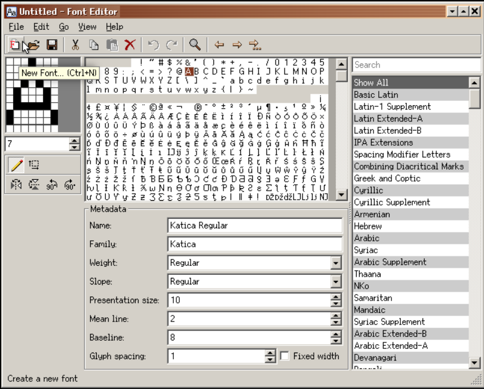

To create a new font, you can either click on the New Font on the Toolbar or go to File -> New Font on the Menubar.
A wizard will walk you into preparing the needed parameters for your new font.

### Typeface Properties
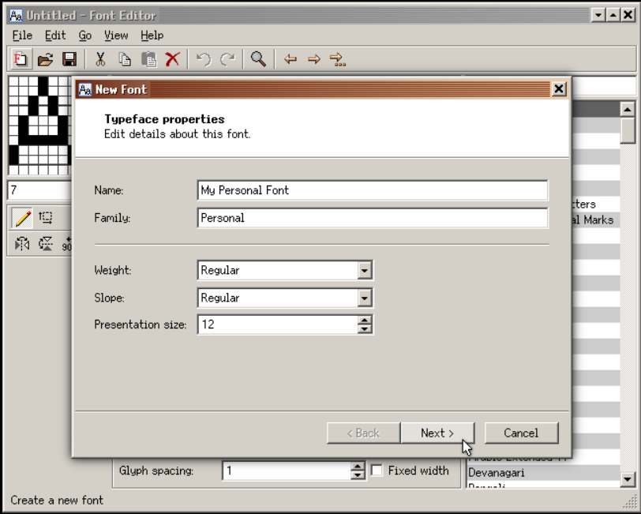

You can try out the default values just to get the feel of the program.

### Glyph Properties
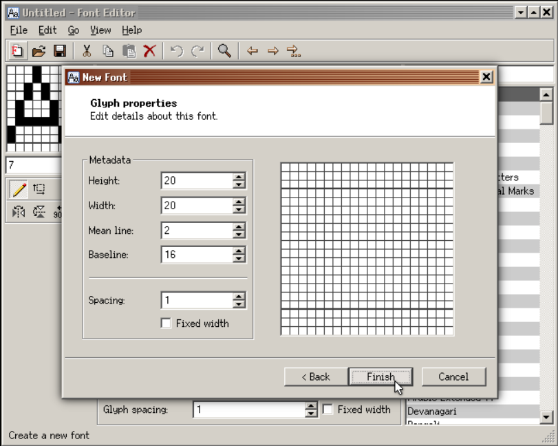

Just click **Finish** if you are so inclined.

### Edit Glyph Properties
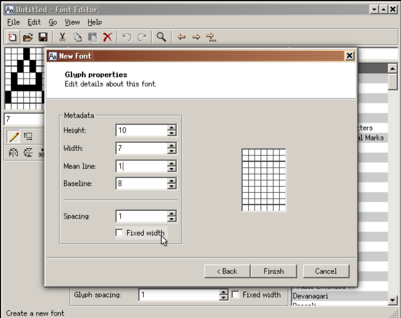

Adjust values to suit your needs. The higher the value, the larger the font size.

### Untitled font
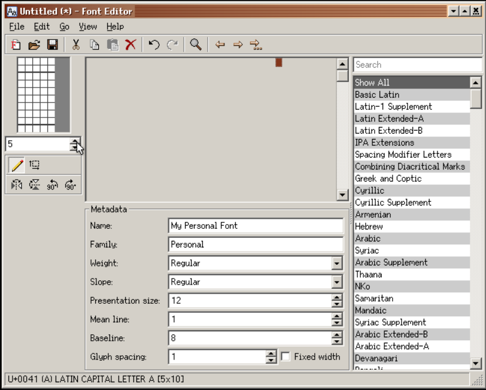

Congratulations on your successful initial font setup. Now you are ready to begin.

### Launch another instance
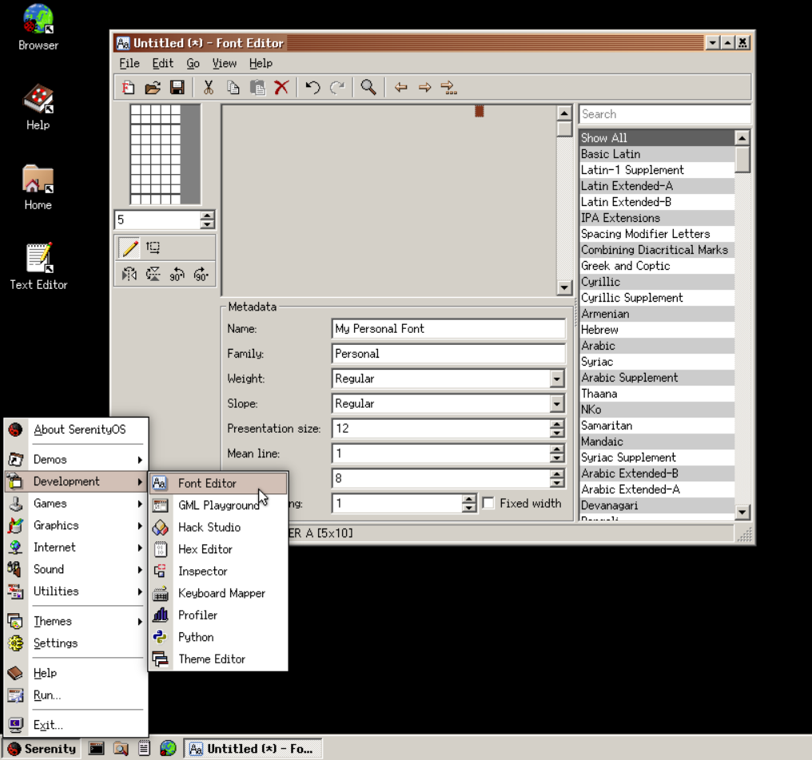

FontEditor! I choose you! (fontie~~~ fontie-fontie) [Shameless Picachu imitation]

### Side by side
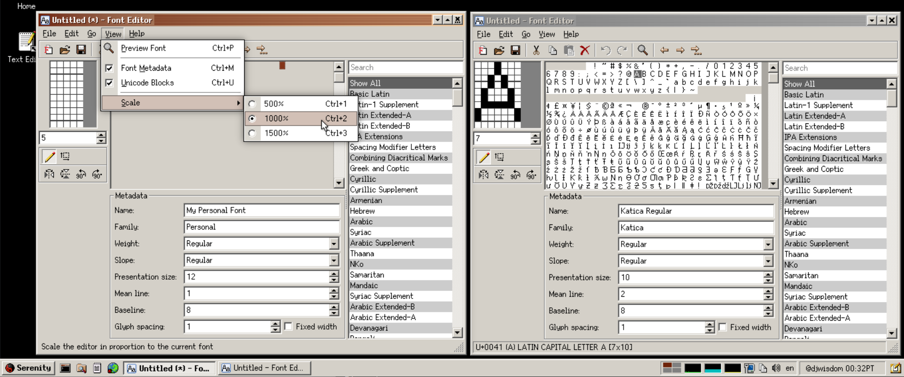

Having another instance of FontEditor can help boost your productivity. This is most noticeable when one is just starting with FontEditor and trying out how to best make use of the application.

### Save font
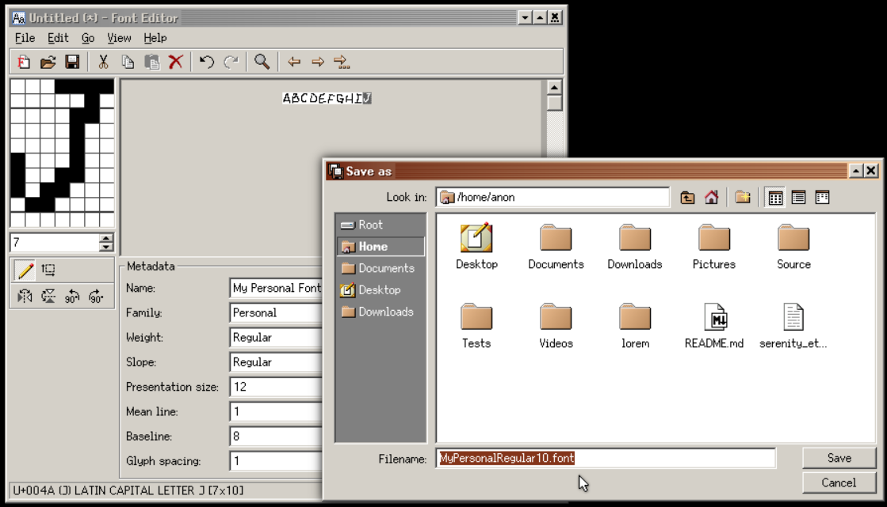

Save your font by following the recommended ` FontName + FontStyle + FontPresentationSize + .font ` naming convention.

### Continue Editing
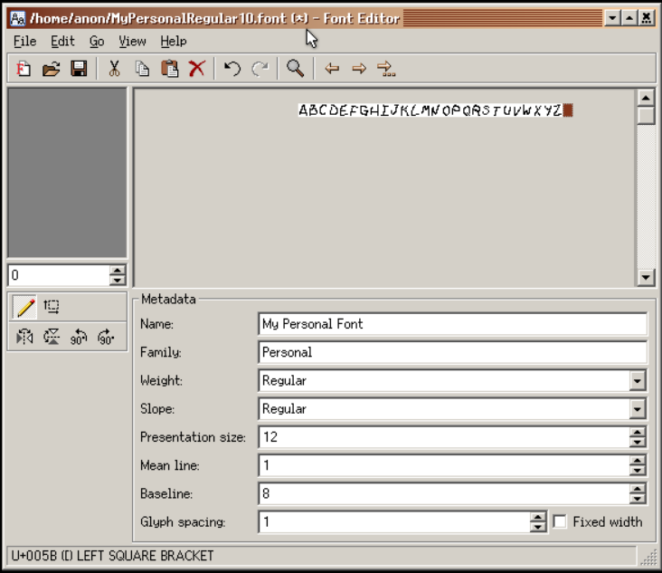

You continue editing your font by adding more glyphs into it, remember to always save and save often.

### fonts.serenityos.net
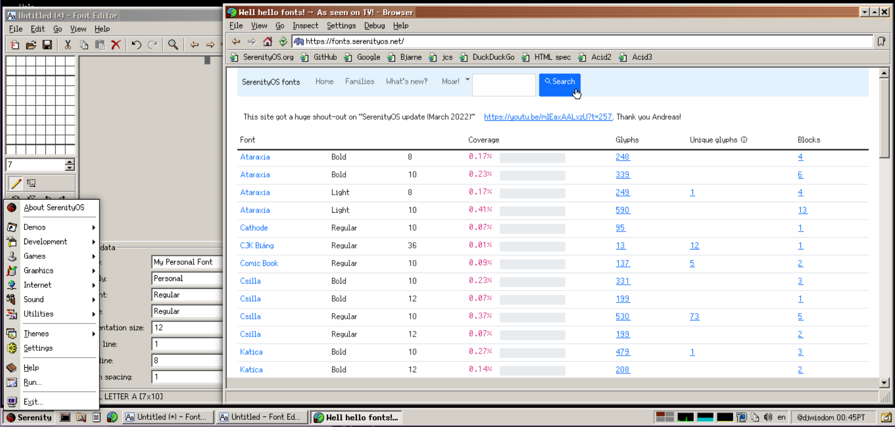

It is highly recommended to use our own https://fonts.serenityos.net as one of your primary resource for glyph and font information. The other one is https://home.unicode.org and https://wiki.serenityos.net.

### Search glyph
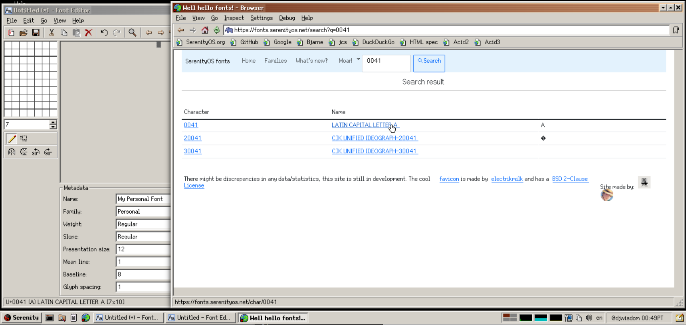

Figure above depicts a search session on fonts.serenityos.net portal.

### Search detail
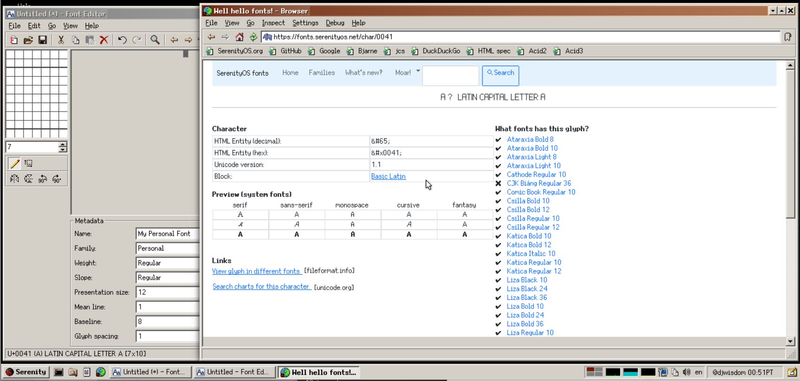

The same search session displaying result of the previous query.

So there you have it, by now you have at least an idea of how to make ***SerenityOS*** fonts using **FontEditor**. For any font-related questions or inquiries, just drop by the official SerenityOS discord channel and join https://discord.com/channels/830522505605283862/927893781968191508.
