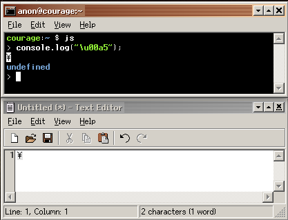

# User guide
## Keyboard shortcuts

| Shortcut | Action |
| ---: | --- |
| `✲ Ctrl` + `⎇ Alt` + `Space` | Open emoji picker |
| `⌘ Super` + `Space` | Open assistant |
| `F2` | Rename file |
| `⌘ Super` + `↓ Down` | Minimize window |
| `⌘ Super` + `↑ Up` | Maximize window |
| `⌘ Super` + `← Left` | Tile window left |
| `⌘ Super` + `→ Right` | Tile window right |
| `⌘ Super` + `↹ Tab` | Cycle between windows |

## Settings

## User

## Time

## Insert Unicode

_How to insert Unicode that's not covered in one of the keyboard character mapping file._

__Option 1: Copy character from Font Editor__

Select the character you want in Font Editor and press `✲ Ctrl` + `⇧ Shift` + `C` to copy the character.

__Option 2: Copy character in terminal__
1. Open Terminal
2. `copy "\u000000a5"`
3. Character is now in clipboard, `✲ Ctrl` + `V` to paste it somewhere

__Option 3: Create character in terminal using js__
1. Open Terminal
2. Type `js`
3. Use console.log to generate character from hex, if you want the ¥ yen sign character type `console.log("\u00A5");`
4. Copy the character `✲ Ctrl` + `⇧ Shift` + `C`

